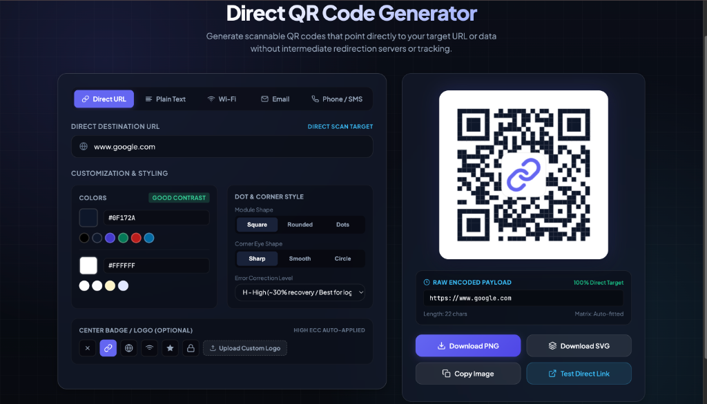

<div align="center">

# ⚡ Direct QR Code Generator

**A blazing-fast, privacy-first, 100% client-side QR code generator that encodes destinations directly without third-party redirects, subscriptions, or tracking servers.**

[](https://github.com/SShehan716/qr-code/stargazers)
[](https://opensource.org/licenses/MIT)
[](https://github.com/SShehan716/qr-code/pulls)
[](#)
[](#)

<br />

[✨ Live Demo](#-quick-start) • [🚀 Features](#-key-features) • [🛡️ Why Direct QR?](#-why-direct-qr) • [📦 Quick Start](#-quick-start) • [🤝 Contributing](#-contributing)

<br /><br />



</div>

<hr />

## 🚨 The Problem with Most Online QR Generators

Have you ever created a QR code from a random online website, printed 500 business cards or posters, only to realize later that:
- ❌ The link routes through a suspicious third-party redirect URL (e.g. `qr-gen.xyz/click?id=12345`).
- ❌ The service suddenly demands a monthly fee or expires your QR code after 14 days.
- ❌ The redirect service injects tracking cookies or breaks when their servers go down.

## 💡 The Solution: Direct QR Code

**Direct QR Code Generator** encodes your target URL or data **directly into the QR code matrix**. 
When scanned, any mobile device's camera navigates **immediately to your actual URL** with:
- 🔒 **Zero Middleman Redirects**
- 🛡️ **100% Privacy & Zero Telemetry**
- ♾️ **Permanent Lifetime Scans** (QR code will work forever)
- ⚡ **Works 100% Offline** (No backend, no internet required)

<hr />

## 🚀 Key Features

- 🎯 **Direct URL & Payload Encoding**: Encodes raw `https://...`, `WIFI:`, `mailto:`, `tel:`, `smsto:` directly.
- 🔍 **Live Raw Payload Inspector**: Inspect the exact decoded string and byte length in real time to verify zero middleman proxying.
- 🎨 **Deep Customization**:
  - **Colors**: Foreground & background color pickers + curated palettes.
  - **Contrast Checker**: Built-in WCAG contrast validation to ensure effortless scanability.
  - **Module Shapes**: Square, Rounded, or Dots.
  - **Corner Eye Shapes**: Sharp, Smooth, or Circular.
  - **Error Correction Levels**: L (7%), M (15%), Q (25%), and H (30% for logo overlays).
  - **Center Logo Badge**: Preset icons or upload your own custom PNG/SVG logo.
- 💾 **Export Options**:
  - **High-Resolution PNG** (1024×1024 px for ultra-crisp print quality).
  - **Vector SVG** (Infinite lossless scaling for vector graphics and design tools).
  - **Copy to Clipboard** (Instant PNG copy for fast sharing).
  - **Test Direct Link** (One-click sanity check to open target URL).
- 📱 **Mobile & Desktop Responsive**: Clean dark glassmorphic UI powered by pure Vanilla HTML/CSS/JS.

<hr />

## 📦 Quick Start

### 1. Clone the repository
```bash
git clone https://github.com/SShehan716/qr-code.git
cd qr-code
```

### 2. Run locally (No build steps / Zero dependencies)
Simply open `index.html` in your favorite web browser:

```bash
# macOS
open index.html

# Linux
xdg-open index.html

# Windows
start index.html
```

Or serve via any static server:
```bash
# Python 3
python3 -m http.server 8080

# Node.js npx
npx serve .
```

<hr />

## 🛠️ Tech Stack & Architecture

- **Core**: Vanilla HTML5, Vanilla Modern JavaScript (ES6+).
- **Styling**: Vanilla CSS with CSS Custom Properties, Glassmorphism, and Flex/Grid layouts.
- **Engine**: Standalone, lightweight client-side QR generation engine (`qrcode.min.js`).
- **Dependencies**: **0** (No npm installs, no webpack/vite build pipeline required).

<hr />

## 📋 Direct Payload Formats Supported

| Type | Raw Payload Format | Scanner Behavior |
| :--- | :--- | :--- |
| **Direct URL** | `https://yourwebsite.com/page` | Opens webpage directly |
| **Wi-Fi Network** | `WIFI:T:WPA;S:NetworkName;P:Password;;` | Prompts instant "Join Network" dialog |
| **Plain Text** | `Raw text or notes` | Displays text or copies to clipboard |
| **Email Action** | `mailto:user@domain.com?subject=Hello` | Opens default email client with draft |
| **Direct Call** | `tel:+1234567890` | Prompts dialer with phone number |
| **Direct SMS** | `smsto:+1234567890:Message` | Opens messaging app with prefilled text |
| **WhatsApp** | `https://wa.me/1234567890?text=Hello` | Opens WhatsApp conversation directly |

<hr />

## 🌟 How to Boost GitHub Reach & Engagement

> [!TIP]
> **Recommended GitHub Repository Settings for Maximum Reach:**
> 
> 1. **Add Repository Topics**: On your GitHub repository page (top right "About" gear icon), add these search tags:
>    `qr-code`, `qr-code-generator`, `javascript`, `privacy-first`, `no-redirect`, `svg-export`, `client-side`, `vanilla-js`, `offline-ready`, `tools`, `web-application`.
> 2. **Enable GitHub Pages**:
>    Go to **Settings** → **Pages** → Source: **Deploy from a branch (`main` / `/root`)**. Add the live link to the repository header.
> 3. **Social Preview Image**: Upload a high-res screenshot or banner in **Settings** → **General** → **Social preview**.
> 4. **Share in Developer Communities**:
>    - [Product Hunt](https://www.producthunt.com/)
>    - [Hacker News (Show HN)](https://news.ycombinator.com/show)
>    - [Reddit (r/webdev, r/javascript, r/opensource)](https://reddit.com/r/webdev)
>    - [Dev.to](https://dev.to) & [Hashnode](https://hashnode.com)

<hr />

## 🤝 Contributing

Contributions, issues, and feature requests are welcome!

1. Fork the Project
2. Create your Feature Branch (`git checkout -b feature/AmazingFeature`)
3. Commit your Changes (`git commit -m 'Add some AmazingFeature'`)
4. Push to the Branch (`git push origin feature/AmazingFeature`)
5. Open a Pull Request

<hr />

## 📄 License
Distributed under the **MIT License** &copy; 2026 Sachin Shehan. See [LICENSE](LICENSE) for the full license text.

<div align="center">

**If you find this project useful, please consider giving it a ⭐ star on GitHub!**

</div>
